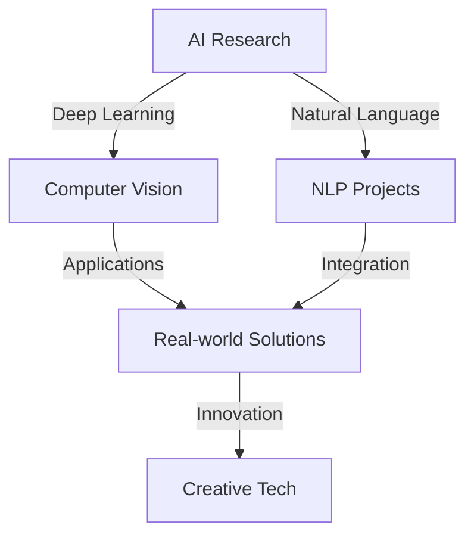

<div align="center">
  

```ascii
  ╔══════════════════════════════════════════╗
  ║                                          ║
  ║   🎯 Innovation Driven | 🤖 AI Explorer   ║
  ║   🌟 Code Architect | 🚀 Tech Enthusiast  ║
  ║                                          ║
  ╚══════════════════════════════════════════╝
```

  <div align="center">
    
    
    
  </div>

  <div id="badges">
    <a href="https://www.linkedin.com/in/rani03/">
      
    </a>
    <a href="mailto:ranip130303@gmail.com">
      
    </a>
  </div>

  <!-- Dynamic Typing Effect -->
  
</div>

<h2 align="center">⚡ Tech Stack Navigator ⚡</h2>

<div align="center">
  
| 🧠 AI & ML | 💻 Development | 🔧 Tools | 🎨 Creative |
|------------|---------------|----------|------------|
| TensorFlow | Python | Git | Data Viz |
| PyTorch | JavaScript | Docker | Generative AI |
| Scikit-learn | AWS | ML Art | Processing |
| OpenCV | Node.js | Kubernetes |

</div>

```console
root@rani:~$ tree skills/
skills/
├── artificial_intelligence/
│   ├── deep_learning
│   ├── computer_vision
│   └── nlp
├── development/
│   ├── backend
│   └── research
└── creativity/
    └── innovation
```

<details>
<summary>🎯 Current Focus Areas</summary>
<br>



</details>

<!-- Quick Stats -->
<div align="center">
  <details>
    <summary>📊 GitHub Stats</summary>
    <div>
      <br/>
      
      <br/><br/>
      
    </div>
  </details>
</div>

<!-- Activity Graph -->
<details>
  <summary>📈 Activity Graph</summary>
  <br/>
  
</details>

<!-- Dev Quote -->
<div align="center">
  <details>
    <summary>💭 Dev Quote of the Day</summary>
    <br/>
    
  </details>
</div>