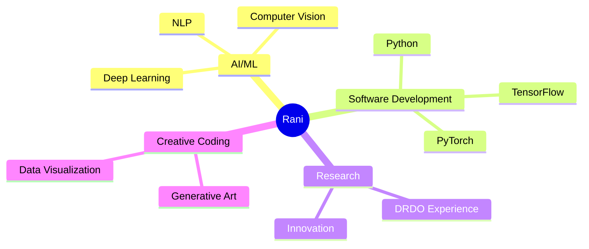

<div align="center">
  
  
```python
def welcome_message():
    print("""
    🚀 Welcome to my digital garden! 
    Where AI meets creativity and code transforms into innovation.
    """)

if visitor == "you":
    welcome_message()
    stars += 1
```

  <div id="badges">
    <a href="https://www.linkedin.com/in/rani03/">
      
    </a>
  </div>
  
</div>

<!-- Custom SVG Banner -->
<svg width="100%" height="150" viewBox="0 0 800 150" fill="none" xmlns="http://www.w3.org/2000/svg">
  <style>
    .header {
      font: 600 38px 'Segoe UI', Ubuntu, Sans-Serif;
      animation: fadeInAnimation 1.2s ease-in-out forwards;
    }
  </style>
  <rect width="100%" height="150" fill="url(#grad1)"/>
  <defs>
    <linearGradient id="grad1" x1="0%" y1="0%" x2="100%" y2="0%">
      <stop offset="0%" style="stop-color:#7A3AEA;stop-opacity:1" />
      <stop offset="100%" style="stop-color:#3A89EA;stop-opacity:1" />
    </linearGradient>
  </defs>
  <text x="50%" y="50%" text-anchor="middle" class="header" fill="white">
    AI/ML Developer × Creative Coder × Innovation Explorer
  </text>
</svg>

<h2>🧬 My Digital DNA</h2>



<h2>🎯 Current Trajectory</h2>

<table>
  <tr>
    <td width="50%">
      <h3 align="center">AI Research 🔬</h3>
      <p align="center">
        
      </p>
      <p align="center">Exploring the frontiers of machine learning and artificial intelligence</p>
    </td>
    <td width="50%">
      <h3 align="center">Creative Projects 🎨</h3>
      <p align="center">
        
      </p>
      <p align="center">Building innovative solutions that merge art and technology</p>
    </td>
  </tr>
</table>

<h2>💫 Skills Universe</h2>

<div align="center">

```javascript
const skills = {
  languages: ['Python', 'JavaScript', 'C++'],
  ai_ml: ['TensorFlow', 'PyTorch', 'Scikit-learn'],
  current_focus: 'Building AI-powered creative tools',
  fun_fact: 'I love combining hiking with photography 📸'
};
```

</div>


<h2>🌊 Activity Wave</h2>

<div align="center">
  
</div>

<div align="center">
  
```python
# Life Philosophy
while alive:
    eat()
    sleep()
    code()
    repeat()
```

</div>

<h2>📫 Let's Connect</h2>

<div align="center">
  <p>Got an interesting project in mind? Let's make it happen!</p>
  <code>rani.dev @ my-email.com</code>
</div>

<!-- Hidden Easter Egg - Try highlighting the text below! -->
<div align="center" style="color: #0000">
  🎉 You found the easter egg! You're the kind of person who looks at the source - we should definitely connect! 
</div>

<!-- Custom Footer -->
<div align="center">
  
</div>